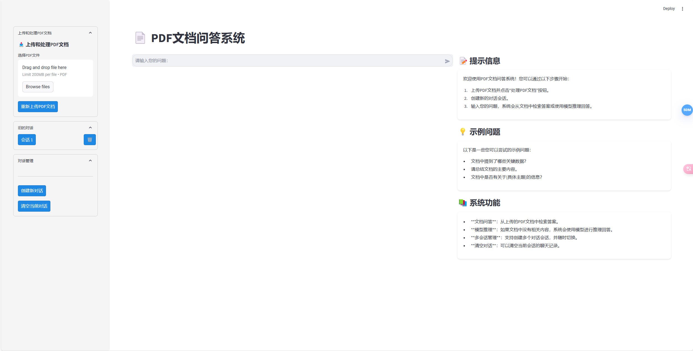
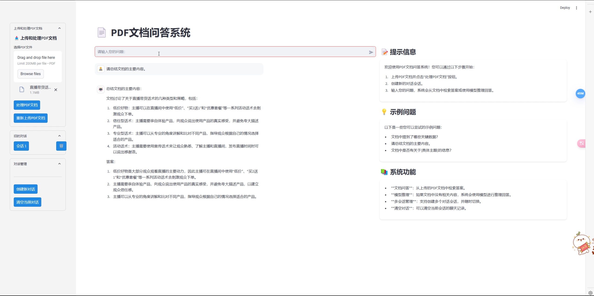
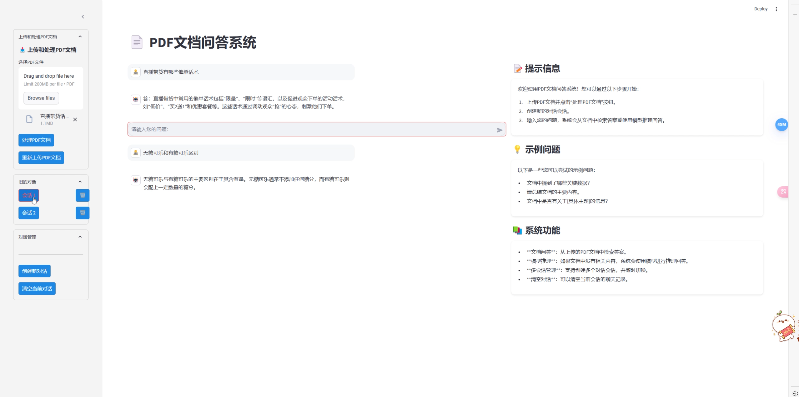

# **PDF 文档问答系统**

## **一、项目概述**
**本 PDF 文档问答系统基于 Streamlit 和 LangChain 构建，允许用户上传 PDF 文档，并针对文档内容进行提问。系统借助 Ollama 进行语言模型推理，实现对文档内容的检索与回答，为用户提供高效的文档问答服务。**
## 二、功能特点
**PDF 上传与处理**：用户可轻松上传 PDF 文档，系统自动完成文本提取和嵌入处理，为后续问答提供数据支持。

**问答界面**：提供直观的聊天式界面，用户输入问题后，能快速获得基于文档内容的精准答案。

**会话管理**：支持创建新会话，满足不同文档或主题的问答需求；可灵活切换会话，方便用户在不同场景间快速切换；还能一键清空会话记录，保持界面整洁。

**语言模型推理**：当文档中无相关内容时，系统利用强大的语言模型进行推理，给出合理回答。
## 三、环境要求
**Python 环境**：需安装 Python 3.8 及以上版本。

**关键依赖库**：

**Streamlit**：用于搭建交互式 Web 应用界面，通过pip install streamlit安装。

**LangChain**：处理语言模型的框架，执行pip install langchain安装。

**Ollama**：提供语言模型推理服务，根据官方文档进行安装。
## 三、项目截图
**主界面**

**对文档问题提问测试**

**对文档外内容提问测试**

## 四、使用方法
**启动应用**：在项目根目录下的终端输入streamlit run main.py，启动问答系统。若未自动打开，可根据终端提示的 URL 在浏览器中访问。

**上传 PDF 文档**：在应用界面找到文件上传区域，选择本地 PDF 文档进行上传，系统将自动处理。

**提问与获取答案**：在聊天界面输入问题，点击发送或按回车键，系统会给出基于文档内容的答案。

**创建新会话**：点击相应按钮，开启新的问答会话。

**切换会话**：通过会话选择菜单，切换到已有会话。

**清空会话**：点击清空会话按钮，清除当前会话记录。
